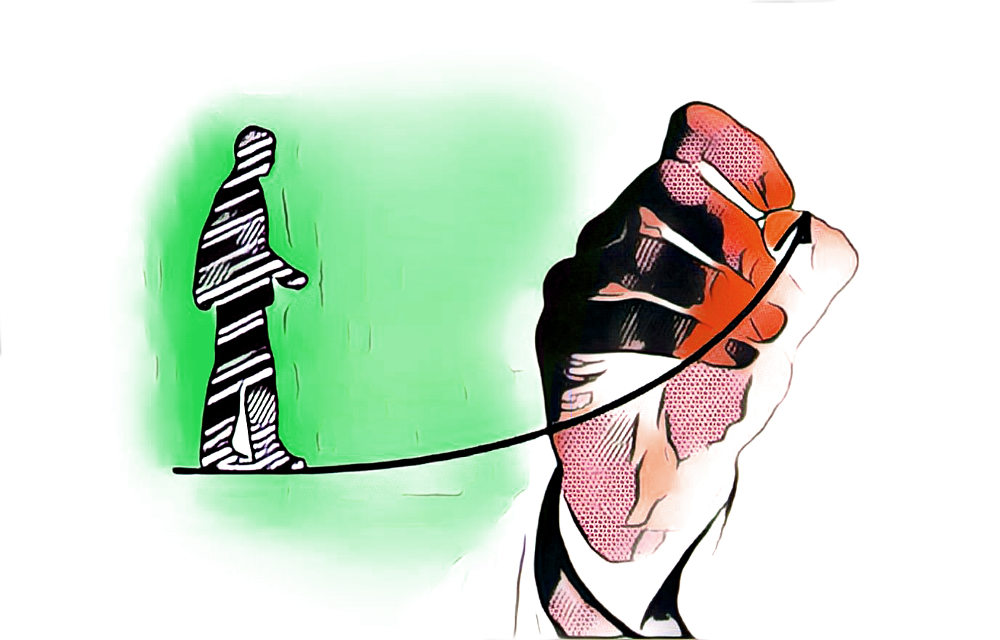

# 1% improvement system

In the beginning, there is basically no difference between making a choice that is 1% better or 1% worse. But as time goes on, these small improvements or declines compound and you suddenly find a very big gap between people who make slightly better decisions on a daily basis and those who don’t. 

## **BENEFITS**

* Improving by just 1 percent isn’t notable \(and sometimes it isn’t even noticeable\)
* Almost every habit that you have — good or bad — is the result of many small decisions over time.
* The goals are more achievable because tiny actions have less resistance.
* This is why the system is greater than the goals

## **TUTORIAL**

1. Measure or quantify any task
2. Each reasonable time increase the task with 1% from original value


The pattern works in reverse: many small choices — a 1% decline here and there — leads to a problem.


## RESOURCES

[www.amazon.com/1-Rule-Process-Achieve-Wildest-ebook/dp/B079Y68D9X](www.amazon.com/1-Rule-Process-Achieve-Wildest-ebook/dp/B079Y68D9X)[www.youtube.com/watch?v=iSIjOn3dGoc](https://www.youtube.com/watch?v=iSIjOn3dGoc)

