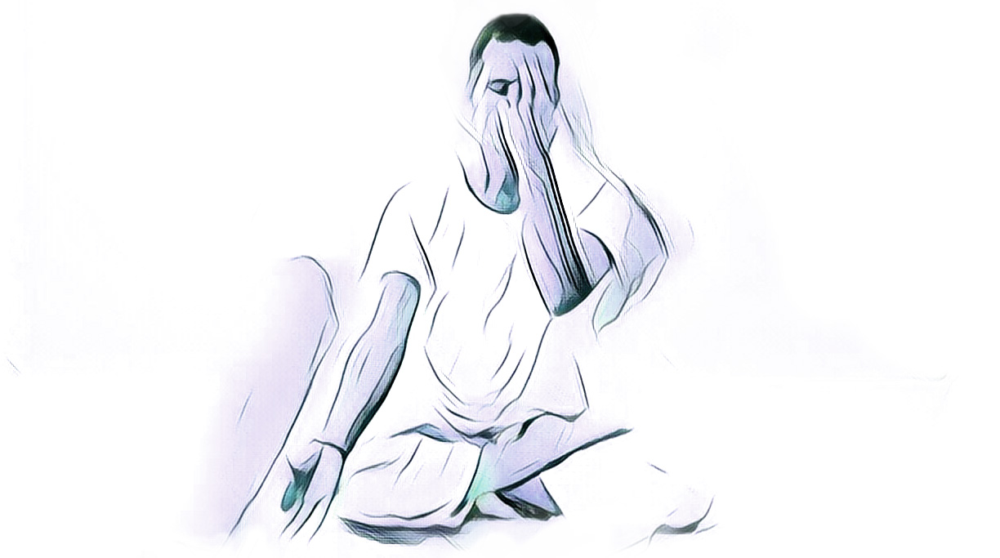

# 9-bottled wind breathing practice

It is a pranayama practice from the Tibetan Bon Buddhist tradition. Breathing exercise cleanses the three main energy pathways in the body. 


Please use it in the beginning of a meditation session to calm and clear the mind.


## BENEFITS

* Reduce stress and anxiety as it calms and centers the mind
* Clean obstacles in subtle body
* Improve and regulate both the cardiovascular, digestive and the respiratory systems
* Heal and purify the nervous system
* Boost energy levels
* Increase the volume of the lungs and oxygenate the blood
* Improve sleep

## TUTORIAL

1. Sit down into meditation posture
2. Visualize that your body becomes as clear as crystal
3. Close the mouth and using the index finger of the left hand to close the left nostril
4. Inhale slowly \(slower the better\) through the right nostril, imagine that all of space inside your body becomes filed with light
5. When the lungs are full, hold the breath and relax the body as much as possible
6. Hold the breath until it is comfortable
7. When the breath can no longer  be retained, exhale it as forcefully and quickly as possible through the other open nostril
8. Repeat this process 3 times \(this is one section\)
9. Start the next section by changing the nostril \(close the right nostrils and breath via left nostrils\) 
10. Repeat this process 3 times
11. Last section is breathing without covering any nostrils
12. Repeat this process 3 times


When you're upset, you breathe rapidly, shallowly and irregularly, but you can't be upset if your breathing is slow, deep, quiet and regular.


## RESOURCES

[https://www.ncbi.nlm.nih.gov/pubmed/29755217](https://www.ncbi.nlm.nih.gov/pubmed/29755217)  
[https://www.ncbi.nlm.nih.gov/pubmed/29321984](https://www.ncbi.nlm.nih.gov/pubmed/29321984)  
[https://www.ncbi.nlm.nih.gov/pubmed/27437210](https://www.ncbi.nlm.nih.gov/pubmed/27437210) [https://www.meditationexpert.com/meditation-techniques/m\_9\_step\_bottled\_wind\_pranayama\_practice.html](https://www.meditationexpert.com/meditation-techniques/m_9_step_bottled_wind_pranayama_practice.html)  

