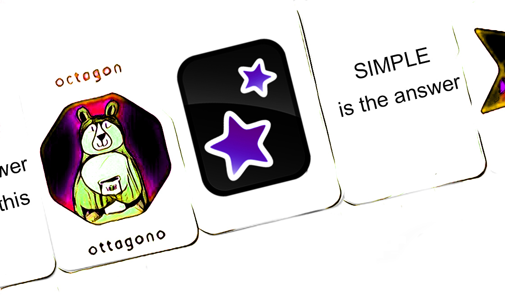

# Anki app

Anki is a program which makes remembering things easy. Because it's a lot more efficient than traditional study methods, you can either greatly decrease your time spent studying, or greatly increase the amount you learn. Anyone who needs to remember things in their daily life can benefit from Anki. Since it is content-agnostic and supports images, audio, videos and scientific markup, the possibilities are endless. The core of the software is the spaced repetition algorithm which ensure extremely efficient learning.

## BENEFITS

* Extremely efficient learning: thanks to the spaced repetition algorithm
* Learning languages
* Studying for  exams
* Memoizing facts
* Bulk import of flashcards
* Highly customizable software
* All OS platforms

## HOW IT WORKS


Anki will have you review each card at the specific point in the forgetting curve you’re most likely to forget it.


The graph above shows how your retention of learned material declines over time when you don’t review it again. With additional review in correct time you will extend the period of remembering and slow down the forgetting.  The correct time is chosen by space repetition algorithm directly in Anki with help of effortless information obtain from the user \(rate the difficulty of the flashcard after you review it\). 

## TUTORIAL

1. Download software from [here](https://apps.ankiweb.net)
2. Install & run
3. Create your own flashcards or download from thousand of flashcard collections
4. Start to learn effectively

## EXAMPLE

{% embed data="{\"url\":\"https://www.youtube.com/watch?v=sQkdB3cJwn0\",\"type\":\"video\",\"title\":\"Anki Tutorial 1: How to install Anki and make your first flashcard\",\"description\":\"This is a basic tutorial for how to use Anki, my favorite flashcard tool. \\n\\nhttp://fluent-forever.com/chapter2\",\"icon\":{\"type\":\"icon\",\"url\":\"https://www.youtube.com/yts/img/favicon\_144-vfliLAfaB.png\",\"width\":144,\"height\":144,\"aspectRatio\":1},\"thumbnail\":{\"type\":\"thumbnail\",\"url\":\"https://i.ytimg.com/vi/sQkdB3cJwn0/maxresdefault.jpg\",\"width\":1280,\"height\":720,\"aspectRatio\":0.5625},\"embed\":{\"type\":\"player\",\"url\":\"https://www.youtube.com/embed/sQkdB3cJwn0?rel=0&showinfo=0\",\"html\":\"
<iframe src=\\\"https://www.youtube.com/embed/sQkdB3cJwn0?rel=0&amp;showinfo=0\\\" style=\\\"border: 0; top: 0; left: 0; width: 100%; height: 100%; position: absolute;\\\" allowfullscreen scrolling=\\\"no\\\"></iframe>
\",\"aspectRatio\":1.7778}}" %}

## RESOURCES

[https://www.sciencedirect.com/science/article/pii/S036013151630077X](https://www.sciencedirect.com/science/article/pii/S036013151630077X)  
[https://www.sciencedirect.com/science/article/pii/0022096591900798](https://www.sciencedirect.com/science/article/pii/0022096591900798)  
[https://www.sciencedirect.com/science/article/pii/S0079742108604648](https://www.sciencedirect.com/science/article/pii/S0079742108604648)  

