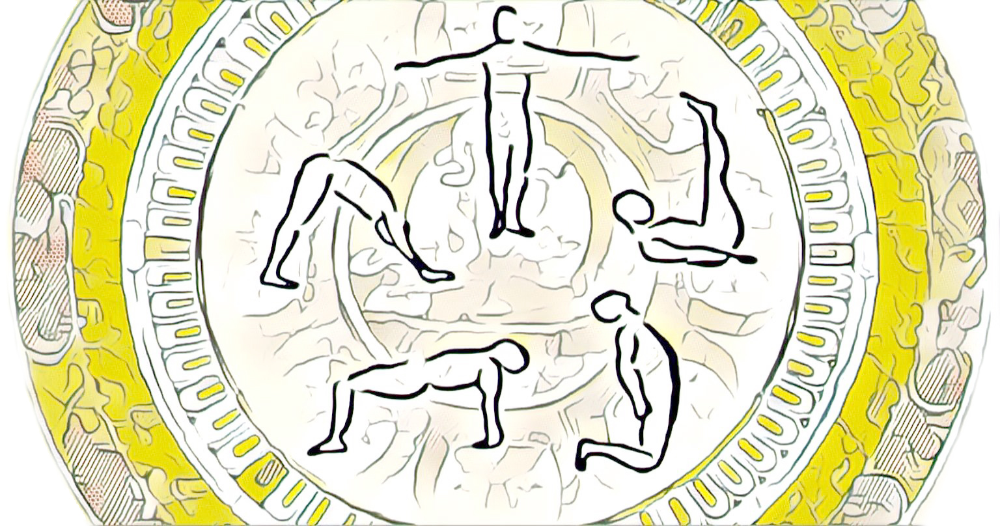
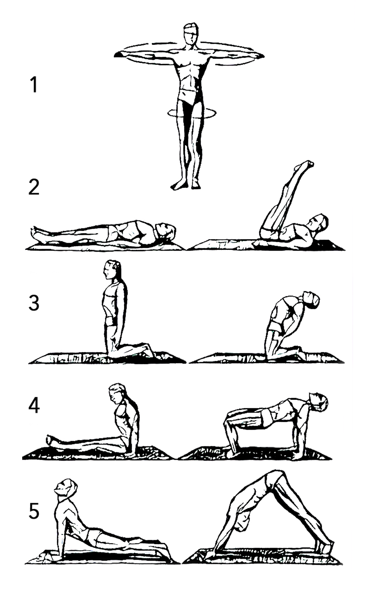

# 5 tibetian rites

Hidden in the high Himalayas 2,500 years ago, Tibetan Lamas developed five simple range of motion exercises they called "Rites." These Rites have remarkable powers of rejuvenation; indeed, they have rightfully been called a "Fountain of Youth." The original texts say they speed up energy vortexes.Those from a yoga background say the Rites strengthen the chakras. Others say they are just good range of motion exercises. Other say that it activate the body's nervous system and stimulate the glands of the body.

## **BENEFITS**

* greater energy
* enhanced sense of well-being
* increased sex drive
* a more youthful appearance
* hair regrowth
* weight loss
* improved eyesight
* better memory
* longer life


The magic is in hidden in long term repetition for few months


## **TUTORIAL**

\*\*\*\*

1. One time per day find 10-15 minutes 
2. Start with rite 1 and repeat it 21 times
3. After the rite is finished make small pause and breathe
4. Go to next rite



## RESOURCES

[https://en.wikipedia.org/wiki/Five\_Tibetan\_Rites](https://en.wikipedia.org/wiki/Five_Tibetan_Rites)

