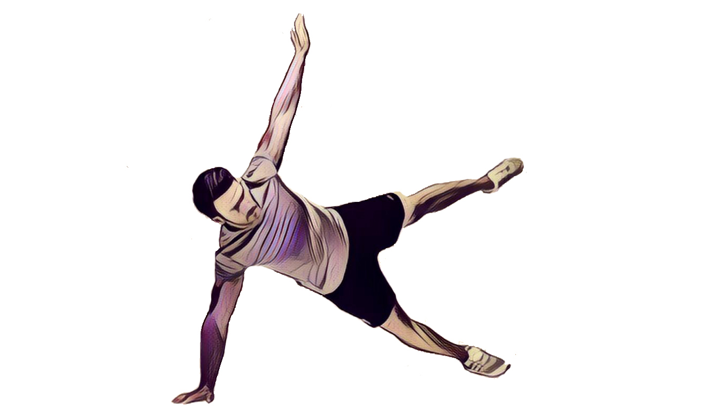
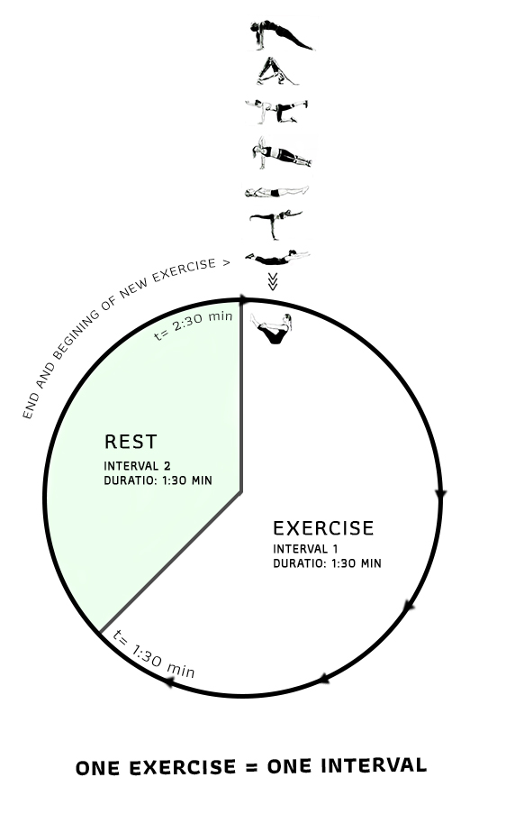
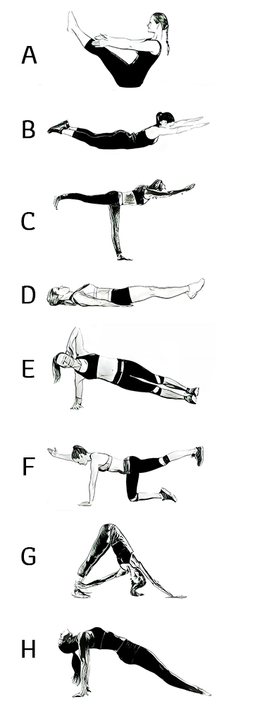

# Isometric exercise

Exercise or a program of exercises to strengthen specific muscles or shape the figure by pitting one muscle or part of the body against another or against an immovable object in a strong but motionless action. Isometric exercises are done without changing the length of the muscles. These exercises work on the muscles in a static position and demand muscle tension without any actual movement. Most of the core conditioning exercises, yoga postures, and even pilates exercises are isometric.

## BENEFITS

1. Build extra strong muscles especially core and ABS muscles
2. Beneficial for preventing back injury and removing lower back pain
3. Not relying on commercial exercise equipment
4. Exercise is an anaerobic activity
5. In one study \(check RESOURCES\) they measure 20% increase of strength by exercising only 6 minute for 1 month!

## OVERVIEW OF PROCESS

## TUTORIAL

1. Set your interval timer like this - INTERVAL 1 \(1:30 min\) and  INTERVAL 2 \(1 minute\)
2. Start with exercise hold posture for 1:30 or till you are able to
3. After this part completely relax your body and rest
4. On beginning of the second interval start with the next exercise from list below and continue in same way

## RESOURCES

[www.jarcet.com/articles/Vol6Iss4/Petrofsky.pdf  
https://jrnlappliedresearch.com/articles/Vol7Iss1/Petrofsky.pdf  
](www.jarcet.com/articles/Vol6Iss4/Petrofsky.pdf
)[https://www.ncbi.nlm.nih.gov/pmc/articles/PMC5500489/](https://www.ncbi.nlm.nih.gov/pmc/articles/PMC5500489/)  
[https://www.ncbi.nlm.nih.gov/pmc/articles/PMC4056589/](https://www.ncbi.nlm.nih.gov/pmc/articles/PMC4056589/)  
[https://www.ncbi.nlm.nih.gov/pmc/articles/PMC1464520/](https://www.ncbi.nlm.nih.gov/pmc/articles/PMC1464520/)  
[https://www.ncbi.nlm.nih.gov/pmc/articles/PMC3392013/](https://www.ncbi.nlm.nih.gov/pmc/articles/PMC3392013/)  

