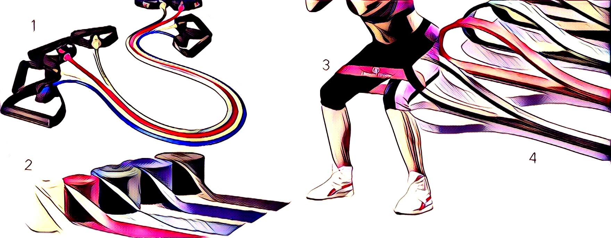
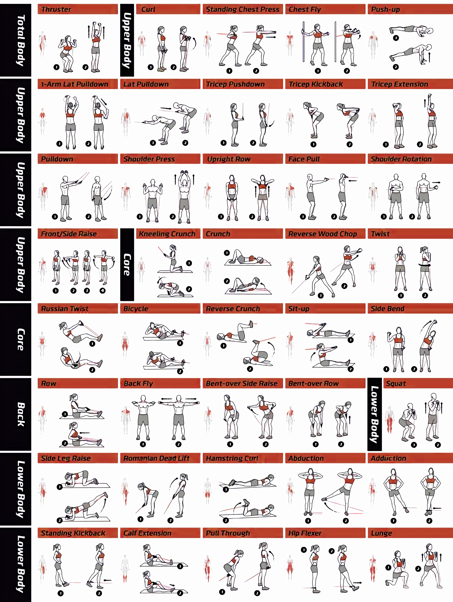

# Resistance bands

A resistance band is a versatile workout tool. It can be used to perform all types of exercises \(upper and lower body\), it’s perfect for strength training and for doing cardio workouts. Bands come in a vast array of sizes and few different types. The materials could differ and so will the resistance that these deliver. 

## BENEFITS

* Simple, effective, affordable
* Compact and lightweight
* Multi functional \(replace the gym thus perfect when traveling\)


Different color represent different resistance of the band. Since there is no unified system, you need to check the resistance brand wise.


| _Number on picture_ | _Type_ | _Description_ |
| :--- | :--- | :--- |
| 1 | Resistance tube | rubber tube with fixed handles on each side |
| 2 | Flat band | super flat rubber in rectangle shape |
| 3 | Loop band small | rubber - latex closed loop \(small version\) |
| 4 | Loop band big | rubber - latex closed loop \(big version\) |

## TUTORIAL

1.  Pick up your band
2. Chose exercise and perform it
3. Adjust the resistance if needed

## EXAMPLE



## RESOURCES

[https://www.ncbi.nlm.nih.gov/pmc/articles/PMC5140827](https://www.ncbi.nlm.nih.gov/pmc/articles/PMC5140827/)  
[https://www.ncbi.nlm.nih.gov/pmc/articles/PMC3588619/](https://www.ncbi.nlm.nih.gov/pmc/articles/PMC3588619/)  
[https://www.hometraininghero.com/what-is-resistance-band-training-the-science/](https://www.hometraininghero.com/what-is-resistance-band-training-the-science/)  

