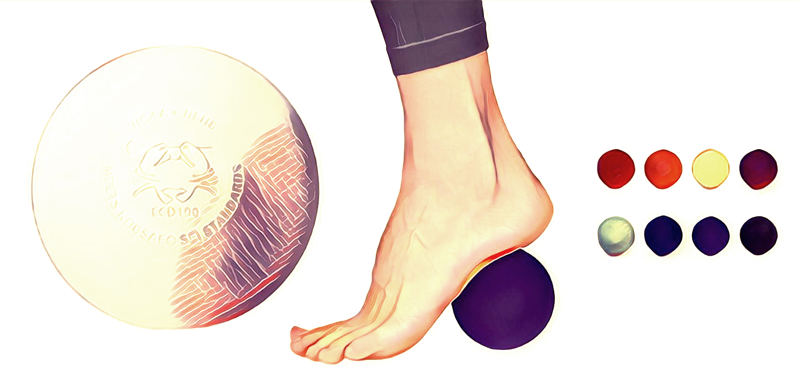
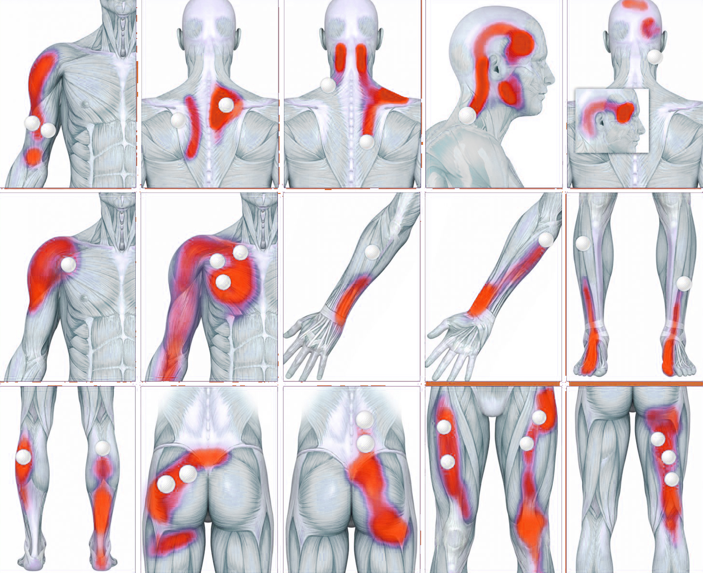

# Lacrosse ball

Lacrosse ball massage is a form of self-myofascial release. Fascia, the thin sheath of connective tissue that covers all the muscles and organs of the body, is responsible for connecting muscle groups. When disrupted, it can cause pain and poor movement patterns. Tight fascia can pull the body out of alignment and increase pressure on muscles and joints, causing pain. 

## BENEFITS

* free & effective massage any time
* pain relief 
* decrease fatigue after exercise
* decrease soreness after exercise
* stretch and loosen the fascia
* increase joint range of motion

## TUTORIAL

1. Chose the treated area
2. Chose best posture for preforming the massage on selected area \(sitting, standing, stretching certain part of body by performing special posture\)
3. Put a ball on area and apply constant pressure and roll slowly around the area
4. You should feel pain, but after release you should feel significant relief

## EXAMPLE



## RESOURCES

[https://www.ncbi.nlm.nih.gov/pmc/articles/PMC4508225](https://www.ncbi.nlm.nih.gov/pmc/articles/PMC4508225/)  
[https://www.ncbi.nlm.nih.gov/pmc/articles/PMC4637917](https://www.ncbi.nlm.nih.gov/pmc/articles/PMC4637917/)  
[http://www.ptonthenet.com/articles/the-science-of-self-myofascial-release-4036](http://www.ptonthenet.com/articles/the-science-of-self-myofascial-release-4036)

