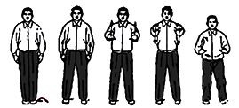
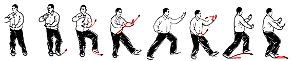
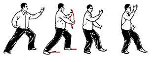
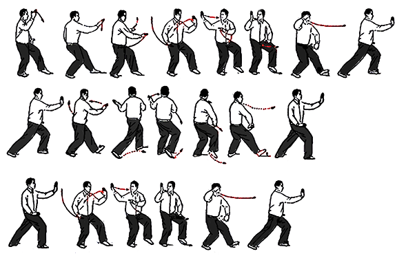
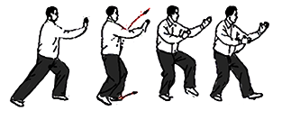
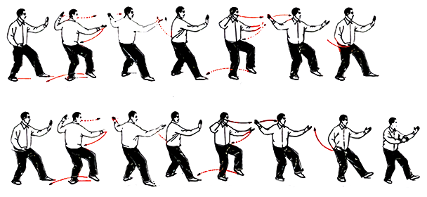
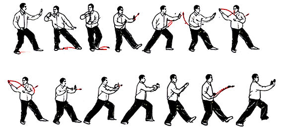

# Tai Chi

Tai Chi Chuan is a Chinese martial art that combines movements for relaxation, health, and self-defense. It is known for slow-moving system of functional training movements, which eventually developed into sets of family forms that were vigorously practiced and passed down through the generations. Today it is mostly recognized for its graceful motion, healthful benefits, and meditative mind quality. An ideal exercise helpful for all ages, it promotes proper alignment, balance, mental focus, agility, coordination, and stamina.

## List of 24 postures \(Yang Style\)

1. Grasp the bird's tail-right style
2. Single whip
3. Wave hands like clouds-left style
4. Single whip
5. High pat on the horse
6. Kick with right heel
7. Strike opponent's ears with both fists
8. Turn and kick with left heel
9. Push down and stand on one leg 
10. Push down and stand on one leg
11. Work at shuttles on both sides
12. Needle at sea bottom
13. Flash the arm
14. Turn, parry and punch
15. Apparent close up
16. Cross hands
17. Closing form

## RESOURCES

[https://www.ncbi.nlm.nih.gov/pubmed/25047456](https://www.ncbi.nlm.nih.gov/pubmed/25047456)  
[https://www.ncbi.nlm.nih.gov/pubmed/24078491](https://www.ncbi.nlm.nih.gov/pubmed/24078491)  
[https://www.ncbi.nlm.nih.gov/pubmed/24406709](https://www.ncbi.nlm.nih.gov/pubmed/24406709)  
[https://www.ncbi.nlm.nih.gov/pubmed/24078491](https://www.ncbi.nlm.nih.gov/pubmed/24078491)  
[https://www.ncbi.nlm.nih.gov/pubmed/25680184](https://www.ncbi.nlm.nih.gov/pubmed/25680184)  
[https://www.ncbi.nlm.nih.gov/pubmed/27460789](https://www.ncbi.nlm.nih.gov/pubmed/27460789)  
[https://www.ncbi.nlm.nih.gov/pubmed/28661865](https://www.ncbi.nlm.nih.gov/pubmed/28661865)  
[https://www.ncbi.nlm.nih.gov/pubmed/23538081](https://www.ncbi.nlm.nih.gov/pubmed/23538081)  

