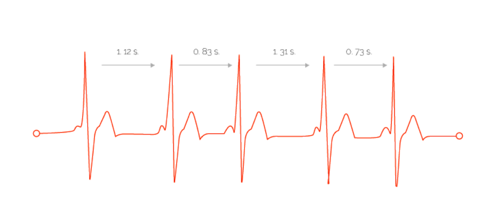

# Heart Rate Variability

Heart rate variability \(HRV\) is the physiological phenomenon of variation in the time interval between heartbeats. It is measured by the variation in the beat-to-beat interval. When measured alone, without any other context, HRV tells you the general state of your nervous system and health but cannot tell you what is causing or affecting your condition. Tracking HRV in conjunction with additional context such as energy levels, fitness tests, sleep quality, a food log, etc. can help you identify what specific lifestyle factors are most affecting your systemic health and progress.

## TUTORIAL

* Measure 5+ days per week.
* Measure in the same position at the same time of day \(or understand the effects of these differences\).

## SOURCES

* [https://en.wikipedia.org/wiki/Heart\_rate\_variability](https://en.wikipedia.org/wiki/Heart_rate_variability)

