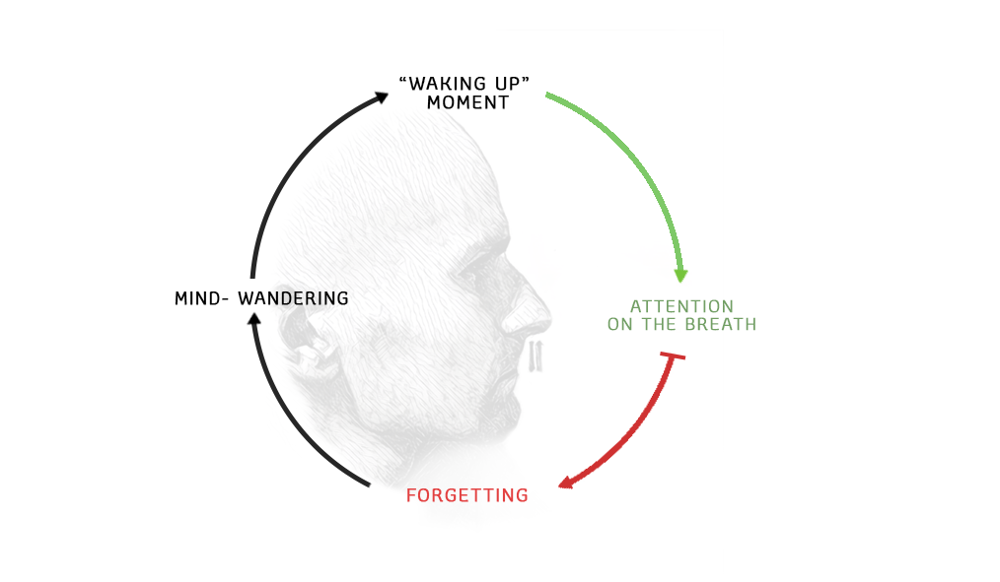

# Meditation - Ānāpānasati

Ānāpānasati \(in Pali language\), meaning "mindfulness of breathing is a form of Buddhist meditation originally taught by Gautama Buddha. Now it is common meditation method in Theravada Buddhism, Tibetan, Zen, Tiantai and as well as Western-based mindfulness programs.

## BENEFITS

* The list of benefits is so huge that there is no point to write it here, basically we can say that it improves all areas of life, health, happiness, spirituality, personal development, business..

## TUTORIAL


During the mediation session avoid to be disturbed \(find correct time, turn of mobile, etc...\). This should be few minutes of your day dedicated completely to you.


1. Sit down in comfortable posture with back straight
2. Set and countdown of desired time \(start with 10 minutes and each week add 1% more time\), for details see the this page:

   

3. Start the timer and close your eyes
4. Relax your body and face area
5. Tell yourself that now you are going to watch your breath, any other activities are now not important
6. Watch the area directly below the nostrils and upper lip


Do not follow the breath going inside or outside. Just watch the breath in limited area - around the nostrils and upper lip.


## RESOURCES

[http://www.nspb.net/index.php/nspb/article/viewFile/260/155](http://www.nspb.net/index.php/nspb/article/view/260/155)  
[https://www.ncbi.nlm.nih.gov/pubmed/22685240](https://www.ncbi.nlm.nih.gov/pubmed/22685240)  
[https://www.ncbi.nlm.nih.gov/pmc/articles/PMC3250176/](https://www.ncbi.nlm.nih.gov/pmc/articles/PMC3250176/)  
[https://www.ncbi.nlm.nih.gov/pubmed/24033306](https://www.ncbi.nlm.nih.gov/pubmed/24033306)  
[https://www.ncbi.nlm.nih.gov/pubmed/23643368](https://www.ncbi.nlm.nih.gov/pubmed/23643368)  
[https://www.ncbi.nlm.nih.gov/pubmed/25938614](https://www.ncbi.nlm.nih.gov/pubmed/25938614)  
[https://www.ncbi.nlm.nih.gov/pubmed/26146629](https://www.ncbi.nlm.nih.gov/pubmed/26146629)  
[https://www.ncbi.nlm.nih.gov/pubmed/21035949](https://www.ncbi.nlm.nih.gov/pubmed/21035949)  

