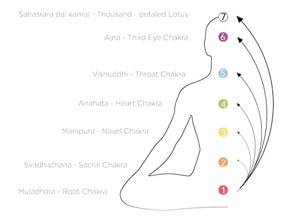

# Ananda mandala

It is a very powerful cleansing meditation used by yogis in India to wash out hidden emotions stuck in the body and open to higher states of consciousness. A guided rhythmic breathing pattern, followed by a concentrated and focused meditation on each chakra \(energy center\), invites deep energetic releases from the body & pathways and it generate a blissful states of mind.

## TUTORIAL

    0. Follow this tutorial bellow or just play track in the end of the page and follow instruction     
        comfortably as audio

1. Sit down in meditation posture
2. Put attention into place \(1\) and breath in
3. Put attention into static place \(7\) and quickly breath out
4. Repeat whole sequence 10x

   5. After each successful sequence change point of from \(1\) to 2,3,4,5,6 until \(7\)   
   6. After this is finish just relax or mediate for longer time, you will start to feel as never in your life

##  AUDIO TUTORIAL



## RESOURCES

[https://www.ncbi.nlm.nih.gov/pubmed/23439436](https://www.ncbi.nlm.nih.gov/pubmed/23439436)  
[https://www.ncbi.nlm.nih.gov/pubmed/23814719](https://www.ncbi.nlm.nih.gov/pubmed/23814719)  
[https://www.ncbi.nlm.nih.gov/pubmed/22121462](https://www.ncbi.nlm.nih.gov/pubmed/22121462)  
[https://www.ncbi.nlm.nih.gov/pubmed/22556548](https://www.ncbi.nlm.nih.gov/pubmed/22556548)[https://www.ncbi.nlm.nih.gov/pubmed/19735239](https://www.ncbi.nlm.nih.gov/pubmed/19735239)

