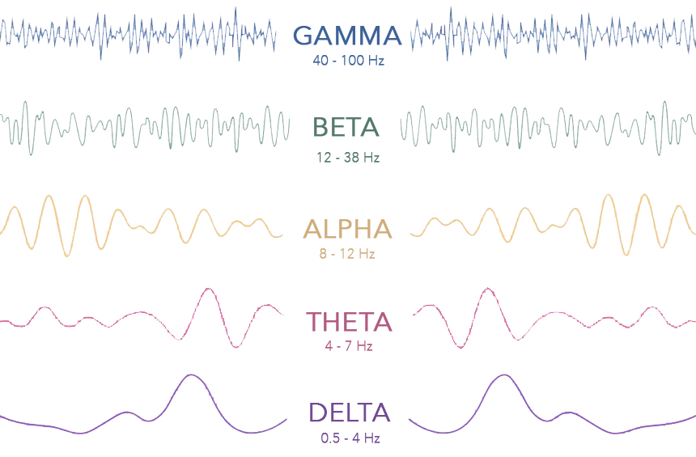

# Brain waves & meditation

## PROBLEMS

* Further studies have been suggested to consider extra frequency ranges and cross-correlation between EEG signals
* There is hundreds of meditation style so there is no fixed correlation
* Some researchers have criticized the traditional approach of investigating strictly defined frequency bands while ignoring the functional interplay between frequencies. This critical view is well justified, because there is hardly any doubt that different frequencies interact in some way and represent different aspects of brain processes. However, so far, there is **no global brain theory in sight.**
* Also meditation effects on the brain activity measured by EEG could be contaminated by the electromuscular artifacts. EEG rhythms show 6 times less power in 25–30 Hz band and 100 times less 40–100 Hz power in paralyzed subjects.

The interesting point is that the traditional EEG frequency bands can be explained by a frequency architecture that is centered around alpha-band activity. The assumption is that the alpha frequency domain, as a basic process of the conscious brain, interacts best with those frequency domains that have a harmonic relationship with the alpha domain and that the separation between frequency domains is obtained with frequency ratios equaling the golden mean. It is a consequence of this assumption to expect that the frequency architecture changes when consciousness changes. 

## RESOURCES

[www.ncbi.nlm.nih.gov/pmc/articles/PMC3507158](www.ncbi.nlm.nih.gov/pmc/articles/PMC3507158)  
[www.ncbi.nlm.nih.gov/pmc/articles/PMC4684838](https://www.ncbi.nlm.nih.gov/pmc/articles/PMC4684838/)  
[www.ncbi.nlm.nih.gov/pmc/articles/PMC5261734](www.ncbi.nlm.nih.gov/pmc/articles/PMC5261734)  
[www.sciencedirect.com/science/article/pii/S0965229912001148](https://www.ncbi.nlm.nih.gov/pubmed/23131369)  
  
[https://imotions.com/blog/eeg/](https://imotions.com/blog/eeg/)

  

