# Brain waves & meditation

## ISSUES

* Further studies have been suggested to consider extra frequency ranges and cross-correlation between EEG signals.
* There is hundreds of meditation style so there is no fixed correlation. And even worst there is no global categorization based on type of object, type of used awareness, or even if the method requires open or closed eyes. 
* Some researchers have criticized the traditional approach of investigating strictly defined frequency bands while ignoring the functional interplay between frequencies. This critical view is well justified, because there is hardly any doubt that different frequencies interact in some way and represent different aspects of brain processes. However, so far, there is **no global brain theory in sight.**
* Also meditation effects on the brain activity measured by EEG could be contaminated by the electromuscular artifacts. EEG rhythms show 6 times less power in 25–30 Hz band and 100 times less 40–100 Hz power in paralyzed subjects.
* There is no global brainwave, just cohesion of the same waves in different parts of the brain.
* Often short period of meditation. 
* Most of the studies ends with: 
  * This study require future elaboration.
  * Future research might profit from this study.
  * The results of this studies are limited...
  * Further studies are needed to understand... 
* Mediation is process not one continuous mental task. In research the meditation section is often not split to parts but is considered as one continuous process starting by short period of time "tuning in" and sometimes even worst from the moment of closing of the eyes! I rarely seen EEG graphs where Y coordinate is brainwaves type / frequency and X coordinate is time. Time factor is important to consider especially for concentration meditation where there are preparing calming periods \(approx. 20 min.\) and also different levels of depth accessible for meditator \(depending on time but mostly and the skills of the meditator\). This "stages" can alter different brainwaves.

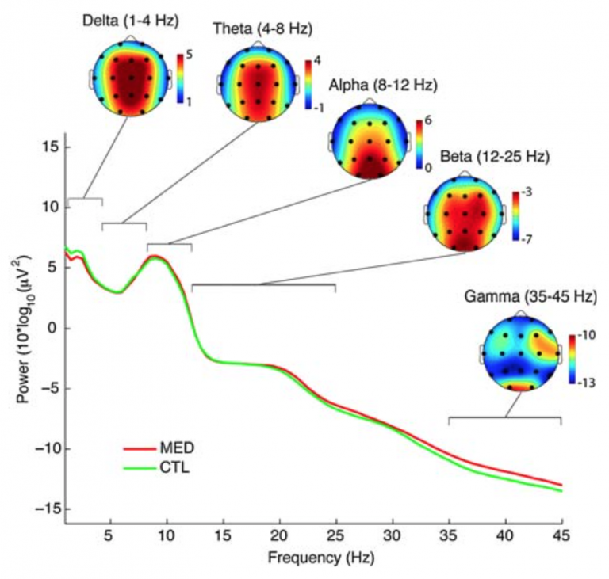

* Brain waves **Interference.** This is phenomenon in which 2 waves superpose to form a resultant wave of greater / lower/ the same amplitude.

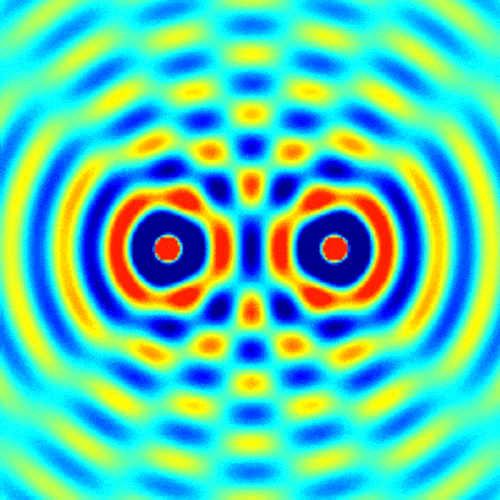

* There is no "pure" meditation session. Mind wandering occurs even for the advanced meditators and may result in change of the brain waves

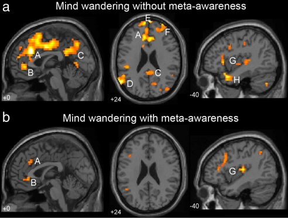

* The brain is not machine with 5 speed gearbox. We cannot simple capture activity and said it is: α,β,γ,δ,θ and if you want improve this cognitive function you need to access this brainwave...We need to understand that cognitive process are depended on what kind of information and what kind of centers are involved in processing and distributing the information. By tracing the main patterns of the individual centers we can understand how the "communication" is changed during meditation. But this require time consuming procedures, therefore scientist want to make it more simple. 
* Maybe there is alpha-band based architecture, and not individual brain waves 

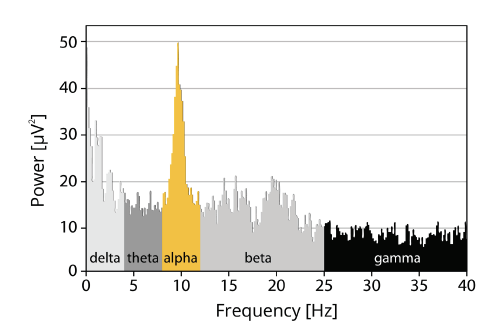

The interesting point is that the traditional EEG frequency bands can be explained by a frequency architecture that is centered around alpha-band activity. The assumption is that the alpha frequency domain, as a basic process of the conscious brain, interacts best with those frequency domains that have a harmonic relationship with the alpha domain and that the separation between frequency domains is obtained with frequency ratios equaling the golden mean. It is a consequence of this assumption to expect that the frequency architecture changes when consciousness changes.

## ALPHA

Research shows that increases in alpha power are generally not reliable markers of meditative states. Increases of alpha power have been observed in tasks requiring the redirection of attention towards internal objects. Alpha frequency was also shown to be correlated to cognitive performance, including the speed at which information is retrieved from memory. A positive correlation between fast and accurate memory performance and alpha frequency was found. Alpha wave activity may also improve word recognition in older adults as well as facilitate working memory. Along with cognitive benefits, elevations in alpha wave activity have also been associated with an increased perception of calmness. Upper alpha band \(∽10–13 Hz\) .

To be it more difficult the spectrum is divided to:

* **Alpha-1 \(Low alpha, 6.9–8.9 Hz\):** inner-awareness of self, mind/body integration, balance
* **Alpha-2 \(Mid-range alpha, 8.9–10.9 Hz\):**
* **Alpha-3 \(High alpha, 10.9–12.9 Hz\)**: specifically reflects encoding memory processes

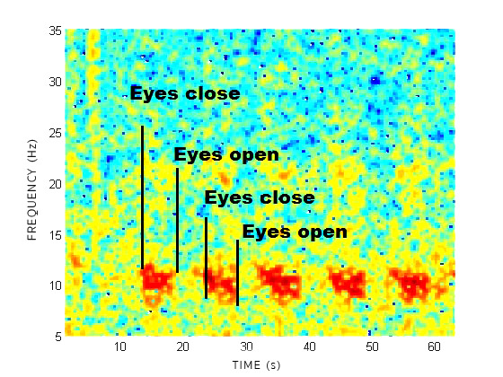

When the subjects opened their eyes, the EEG frequency increased to beta and gamma, and alpha waves were “blocked.” Alpha blocking is considered to be a signal of orientation or interest.

## **THETA**

These types of waves likely originate from a relaxed attention that monitors our inner experiences. Here lies a significant difference between meditation and relaxing without any specific technique. Previous studies have shown that theta waves indicate deep relaxation and occur more frequently in highly experienced meditation practitioners. The source is probably frontal parts of the brain, which are associated with monitoring of other mental processes. These oscillations assist with alertness and the ability to process information quickly. A research study showed that higher theta wave activity was identified in individuals with the lowest anxiety.

> Alpha and theta \(4–7 Hz\) are now known to be involved in many different waking tasks in many parts of the brain. In many cases these near–10 Hz waves seem to coordinate faster oscillations. In a very broad sense, near–10 Hz waves may function as a widespread “system clock” for many parts of the brain. Boundary between theta and alpha is not necessarily clear, and some researchers believe that these waves are not necessarily stable in their conventional range. It has been theorized that a typical EEG signature of meditation can be increase in theta, alpha band power, decrease in at least alpha frequency, and spread of alpha coherence across cortex, its realization needs further research.

## GAMA

Positive correlations between gamma power and the length of lifetime open-awareness meditation. It is a marker of an overall attentive state, the parietal cortex being associated with the focus of attention on a given object. It is also the frequency band associated with rapid eye movement a feature of dream-state sleep, which corresponds with visual perception and delta activity.

> Low-gamma \(25–45 Hz\) and theta \(4–8 Hz\) oscillations are proposed to underpin the integration of phonemic and syllabic information.

## BETA

Beta waves are high-frequency, low-amplitude brain waves that are commonly observed in an awaken state. They are involved in conscious thought and logical thinking, and tend to have a stimulating effect. Having the right amount of beta waves allows us to focus. 

* **Beta-1 \(Low beta, 12–15 Hz\)**: associated mostly with quiet, focused, introverted concentration
* **Beta-2 \(Mid-range beta, \(15–20 Hz\)**: associated with increases in energy, anxiety, and performance
* **Beta-3 \(High beta, 18–40 Hz\)**: associated with significant stress, anxiety, paranoia, high energy, and high arousal.

## DELTA

Delta waves are the slowest recorded brain waves in human beings. Although delta can be active during transcendent states, it is most associated with deep sleep and it is normal and important component of adult sleep. Adequate production of delta waves helps us feel completely rejuvenated and promotes the immune system, natural healing, and restorative/deep sleep.The wider literature suggests that meditative states are distinctly different than sleep states; given prevalent whole brain activation that reflects typical waking consciousness. It is shown that normal resting is associated with increased delta and theta waves compared to meditative states. Increases in delta power were also reported during semantic tasks in children. The origin of delta waves during cognitive processes remains unknown. It has been hypothesized that low frequency oscillations of delta and theta ranges are associated with motivational and emotional processes. Considerable evidence confirms a link between theta activity and emotional states both in animals and in humans.

## MEDITATION & BRAINWAVES

Here the comparison between novices and advanced meditators. Needs to be said that the changes in brainwaves presented here occurs mostly and more intensively for advanced meditators. So if you are beginner please do not expected these changes in brainwaves. Exception here are only mind-wandering or sleepiness. This I gave there to have some baseline, since those states occurs during all mediation techniques. 

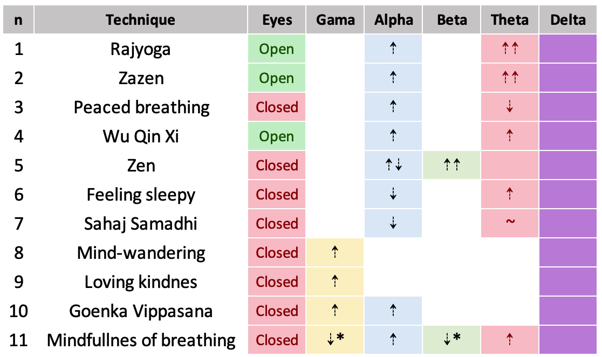

### Details about techniques

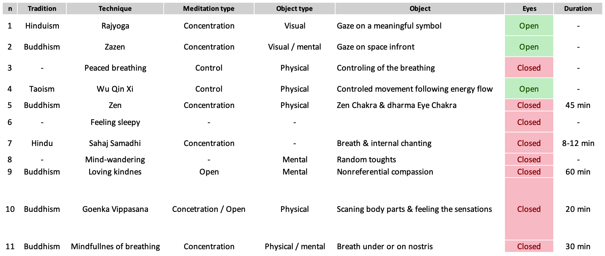

### Links & more information

Another extra information for mediations presented above - please see corresponding number. Numbers in table below contains link to studies.

| n\_\(link\) | Extra info |
| :--- | :--- |
| [1](https://www.ncbi.nlm.nih.gov/pubmed/29343928) | Both alpha and theta can be interpreted as signifiers of increased attention with alpha specifically representing internalized attention as well as indexing states of relaxation. |
| [2](https://dx.doi.org/10.1111/j.1440-1819.1966.tb02646.x) | Changes were also compared with that of the hypnotic trance and sleep. Changes could not be clearly differentiated from those seen in hypnagogic state or the hypnotic sleep, though the changes during practice were more persistent and did not turn into deeper sleep pattern. The rhythmical theta train is suppressed by click stimulation and turns into a desynchronized pattern, whereas the drowsy pattern turns into alpha waves \(the alpha arousal reaction\). |
| [3](https://dx.doi.org/10.1016/j.ctim.2012.07.008) | Indications that parasympathetic activity and internal attention increased, whereas an advanced meditative state was inhibited during  |
| [4](https://dx.doi.org/10.3389/fpsyg.2017.00154) | Mental practice of the dynamic Qigong technique Wu Qin Xi has the same effect on EEG brain activity as physical training considering the eyes-open condition. |
| [5](https://dx.doi.org/10.4015/s1016237206000026) | There always occurred alpha blocking after signaling of perceiving the inner light. |
| [6](https://dx.doi.org/10.1016/S0304-3940%2803%2900033-8) | Alpha waves are also reduced or “suppressed” when the subjects become drowsy or fall asleep, and the EEG shifts to theta and lower-frequency waves. |
| [7](https://dx.doi.org/10.1007/s10339-009-0272-0) | Increased activation in ACC, bilateral prefrontal cortex and reduced activation mainly in the occipital areas. |
| [8](https://dx.doi.org/10.1371/journal.pone.0170647) | Spontaneous mind wandering is typically associated with self-reflective states that contribute to negative processing of the past, worrying/fantasizing about the future, and disruption of primary task performance |
| [9](https://dx.doi.org/10.1073/pnas.0407401101) | The practitioner lets his feeling of loving-kindness and compassion permeate his mind without directing his attention toward a particular object. These phenomenological differences suggest that these various meditative states \(those that involve focus on an object and those that are objectless\) may be associated with different EEG oscillatory signatures. |
| [10](https://dx.doi.org/10.1371/journal.pone.0170647) | A recent model proposes that through the training of localized mindful attention to somatic sensations, mindfulness meditators learn to control alpha oscillations so as to suppress irrelevant sensory input in a top-down fashion. Thus, the global increase of alpha amplitude observed only may be related to the specificity of a meditation style that starts with a somatically focused mindful attention before moving towards mindful open monitoring. |
| [11](https://dx.doi.org/10.1016/j.ijpsycho.2016.09.020) | \* There is a decrease in more deep stage of meditation. |

## VARIOUS CHANGES

1. _**Presence/Monitoring**_ ****_Instruction:_ Try to be in a state of high presence at the place you are in this room at each moment of time. 
2. **T**_**houghtless emptiness \(TE\)**_ ****_Instruction:_ Try to maintain the state of emptiness from all thought as well as possible. 
3. _**Focused attention**_**:**  _Instruction:_  Direct your attention on a spot in the middle of the forehead above your eyes. This spot is sometimes called ‘the 3rd eye’ if you are familiar with this term. 
4. _**Spatial connectedness**_**:**  _Instruction:_ Sit in an upright position. First visualize and then just perceive an interconnecting ‘energy stream’ going through the body axis, and its projection down to earth and up to the sky.

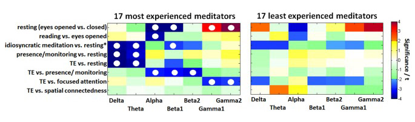

Experienced meditators exhibit a stronger deactivation in the lower bands than non-experienced individuals, when instantiating the state of TE  \(thoughtless emptiness\). We can see a more pronounced activity in the alpha to beta2 bands in the state of _presence/monitoring_, and a stronger activation in the gamma bands in _focused attention_. Only _TE_ and _spatial connectedness_ are almost identical states for the most experienced meditator, but distinct from all other meditative conditions or the _resting_ state. All comparisons of _meditative states_ with _resting_ \(_eyes closed_ or _resting_\) showed almost globally significant decreases in delta and theta power.

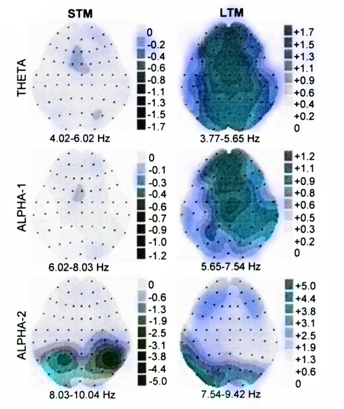

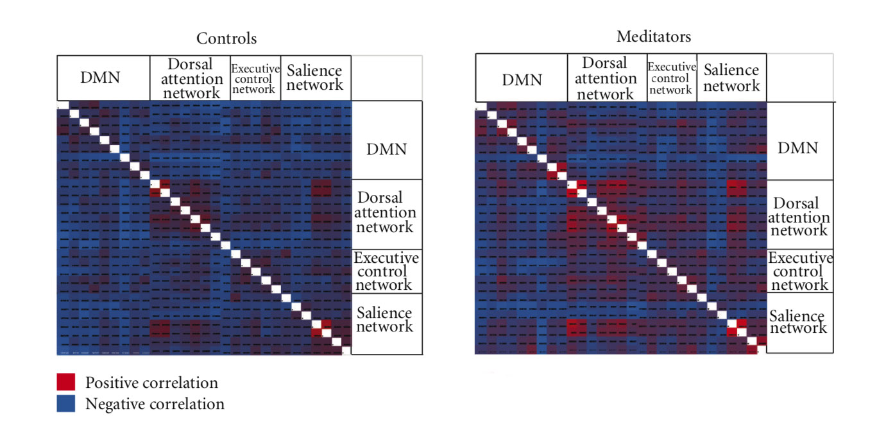

Findings from this study imply the presence of a state by trait interaction, such that brain regions which are functionally coupled during the state of mindfulness become more tightly coupled over time, even during the nonmeditative state. Purportedly, long-term practitioners achieve progressively deeper altered states of consciousness during meditation that come to influence daily life experience outside of meditation. Meditation experience predicted strengthening of msFC between DAN, thalamus, and inferior temporal nodes of the DMN. Allocentric processing is in contradistinction to the more dorsal egocentric stream, which performs object processing in relation to the self. The finding that FC in these networks increased with meditation experience may correspond with accounts of long-term mindfulness practitioners who report experiencing thoughts and feelings as objects without any self-reference.

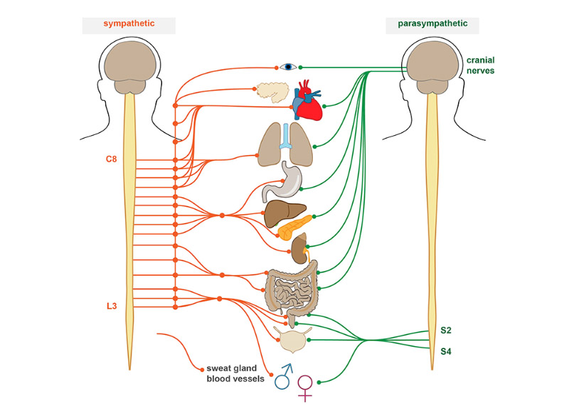

Evidences shows that types of meditation that developed out of certain traditions such as Vajrayana and Hindu Tantric lead to heightened sympathetic activation and phasic alertness, while types of meditation from other traditions such as Theravada and Mahayana elicit heightened parasympathetic activity and tonic alertness. Such findings validate Buddhist scriptural descriptions of heightened arousal during Vajrayana practices and a calm and alert state of mind during Theravada and Mahayana types of meditation and demonstrate the importance of the cultural and philosophical context out of which the meditation practices develop.

## OPEN-END

Different traditions have different meditation methods and different goals they want to archive. It is no surprise that different methods leads to different results consequently leads to different spectrum of brainwave activity and different altered consciousnesses. Here I just need to say:  "Just pick the best one".  

According to Blue Brain project: The human brains are estimated to have a staggering 86 billion neurons, with multiple connections from each cell webbing in every possible direction, forming the vast cellular network that somehow makes us capable of thought and consciousness. The brain reacts to a stimulus by building \[and\] then razing a tower of multi-dimensional blocks, starting with rods \(1D\), then planks \(2D\), then cubes \(3D\), and then more complex geometries with 4D, 5D, etc...up to more then \(11D\) - this is across different parts of the brain. There are tens of millions of these objects even in a small speck of the brain. This interplay define the normal and altered consciousness states. But we are attempting to define  it in range of frequency 0.5-100 Hz... I think this do not require any more elaboration. 

Also consider:

* How can it be that some mediators can experience delta and be awake?
* How some mediators experience alpha waves blocking when they have closed eyes?
* How you can be in alpha state and not be relaxed?, etc....

> It looks like it is more about interplay between different brain centers and not about brainwave alone. The brainwave can be considered as a carrier of this "interplay". Yes, some brainwaves are better and more effective for carrying different kind of information. But the key to understanding it is not the carrier \(the brainwave\), but about it is about the know the message \(information and centers involved\).

My opinion is that studying brainwaves alone and trying to get any real benefit from this will lead to misunderstanding and huge generalizations. Yes, it is interesting, but no much in terms of practicality and benefit for the life. 

## RESOURCES

[www.ncbi.nlm.nih.gov/pmc/articles/PMC3507158](https://github.com/dxcore35/knowledge/tree/cafcf3151acea4f48a207764554c4e6e104f92aa/mind/www.ncbi.nlm.nih.gov/pmc/articles/PMC3507158/README.md)  
[www.ncbi.nlm.nih.gov/pmc/articles/PMC4684838](https://www.ncbi.nlm.nih.gov/pmc/articles/PMC4684838/)  
[www.ncbi.nlm.nih.gov/pmc/articles/PMC5261734](https://github.com/dxcore35/knowledge/tree/cafcf3151acea4f48a207764554c4e6e104f92aa/mind/www.ncbi.nlm.nih.gov/pmc/articles/PMC5261734/README.md)  
[www.sciencedirect.com/science/article/pii/S096522991200114](https://www.ncbi.nlm.nih.gov/pubmed/23131369)[  
www.sciencedirect.com/science/article/abs/pii/S0304394003000338](https://www.sciencedirect.com/science/article/abs/pii/S0304394003000338)  
[www.sciencedirect.com/science/article/abs/pii/S0167876016307152](https://www.sciencedirect.com/science/article/abs/pii/S0167876016307152)  
[www.ncbi.nlm.nih.gov/pmc/articles/PMC5866730/](https://www.ncbi.nlm.nih.gov/pmc/articles/PMC5866730/)  
[www.frontiersin.org/articles/10.3389/fpsyg.2017.00154](https://www.frontiersin.org/articles/10.3389/fpsyg.2017.00154/full)  
[www.link.springer.com/article/10.1007%2Fs10339-009-0272-0](https://link.springer.com/article/10.1007%2Fs10339-009-0272-0)  
[www.journals.plos.org/plosone/article?id=10.1371/journal.pone.0170647](https://journals.plos.org/plosone/article?id=10.1371/journal.pone.0170647)  
[www.pnas.org/content/101/46/16369](http://www.pnas.org/content/101/46/16369)  
[www.journals.plos.org/plosone/article?id=10.1371/journal.pone.0170647](https://journals.plos.org/plosone/article?id=10.1371/journal.pone.0170647)  
[www.onlinelibrary.wiley.com/doi/abs/10.1111/j.1440-1819.1966.tb02646](https://onlinelibrary.wiley.com/doi/abs/10.1111/j.1440-1819.1966.tb02646.x)[  
www.frontiersin.org/articles/10.3389/fncom.2017.00048/full](https://www.frontiersin.org/articles/10.3389/fncom.2017.00048/full)  
[www.eegexplore.blogspot.com](www.eegexplore.blogspot.com)  
[www.imotions.com/blog/eeg](www.imotions.com/blog/eeg/)

