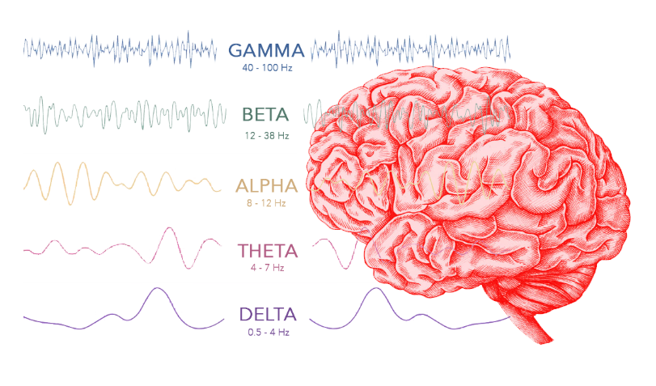

# Brain waves & meditation

## PROBLEMS

* Further studies have been suggested to consider extra frequency ranges and cross-correlation between EEG signals
* There is hundreds of meditation style so there is no fixed correlation
* Some researchers have criticized the traditional approach of investigating strictly defined frequency bands while ignoring the functional interplay between frequencies. This critical view is well justified, because there is hardly any doubt that different frequencies interact in some way and represent different aspects of brain processes. However, so far, there is **no global brain theory in sight.**
* Also meditation effects on the brain activity measured by EEG could be contaminated by the electromuscular artifacts. EEG rhythms show 6 times less power in 25–30 Hz band and 100 times less 40–100 Hz power in paralyzed subjects.

The interesting point is that the traditional EEG frequency bands can be explained by a frequency architecture that is centered around alpha-band activity. The assumption is that the alpha frequency domain, as a basic process of the conscious brain, interacts best with those frequency domains that have a harmonic relationship with the alpha domain and that the separation between frequency domains is obtained with frequency ratios equaling the golden mean. It is a consequence of this assumption to expect that the frequency architecture changes when consciousness changes.

## ALPHA

Research shows that increases in alpha power are generally not reliable markers of meditative states. Increases of alpha power have been observed in tasks requiring the redirection of attention towards internal objects. Alpha frequency was also shown to be correlated to cognitive performance, including the speed at which information is retrieved from memory. A positive correlation between fast and accurate memory performance and alpha frequency was found. Alpha wave activity may also improve word recognition in older adults as well as facilitate working memory. Along with cognitive benefits, elevations in alpha wave activity have also been associated with an increased perception of calmness.

## GAMA

Positive correlations between gamma power and the length of lifetime open-awareness meditation. It is a marker of an overall attentive state, the parietal cortex being associated with the focus of attention on a given object. It is also the frequency band associated with rapid eye movement a feature of dream-state sleep, which corresponds with visual perception and delta activity.

## DELTA

Although delta can be active during transcendent states, it is most associated with deep sleep. The wider literature suggests that meditative states are distinctly different than sleep states; given prevalent whole brain activation that reflects typical waking consciousness.

## GAMMA

## CORRELATIONS

### LINKS & MORE INFO

| n | Study \(DOI link\) | Extra info |
| :--- | :--- | :--- |
| 1 | [https://dx.doi.org/10.4103/ijoy.IJOY\_11\_17](https://dx.doi.org/10.4103/ijoy.IJOY_11_17) | Both alpha and theta can be interpreted as signifiers of increased attention with alpha specifically representing internalized attention as well as indexing states of relaxation. |
| 2 | [https://dx.doi.org/10.1111/j.1440-1819.1966.tb02646.x](https://dx.doi.org/10.1111/j.1440-1819.1966.tb02646.x) | Both alpha and theta can be interpreted as signifiers of increased attention with alpha specifically representing internalized attention as well as indexing states of relaxation. |
| 3 | [https://dx.doi.org/10.1016/j.ctim.2012.07.008](https://dx.doi.org/10.1016/j.ctim.2012.07.008) | Indications that parasympathetic activity and internal attention increased, whereas an advanced meditative state was inhibited during  |
| 4 | [https://dx.doi.org/10.3389/fpsyg.2017.00154](https://dx.doi.org/10.3389/fpsyg.2017.00154) | Mental practice of the dynamic Qigong technique Wu Qin Xi has the same effect on EEG brain activity as physical training considering the eyes-open condition. |
| 5 | [https://dx.doi.org/10.4015/s1016237206000026](https://dx.doi.org/10.4015/s1016237206000026) | There always occurred alpha blocking after signaling of perceiving the inner light. |
| 6 | [https://dx.doi.org/10.1016/S0304-3940\(03\)00033-8](https://dx.doi.org/10.1016/S0304-3940%2803%2900033-8) | Alpha waves are also reduced or “suppressed” when the subjects become drowsy or fall asleep, and the EEG shifts to theta and lower-frequency waves. |
| 7 | [https://dx.doi.org/10.1007/s10339-009-0272-0](https://dx.doi.org/10.1007/s10339-009-0272-0) | Increased activation in ACC, bilateral prefrontal cortex and reduced activation mainly in the occipital areas. |
| 8 | [https://dx.doi.org/10.1371/journal.pone.0170647](https://dx.doi.org/10.1371/journal.pone.0170647) | - |
| 9 | [https://dx.doi.org/10.1073/pnas.0407401101](https://dx.doi.org/10.1073/pnas.0407401101) | - |
| 10 | [https://dx.doi.org/10.1371/journal.pone.0170647\]](https://dx.doi.org/10.1371/journal.pone.0170647%5d) | A recent model proposes that through the training of localized mindful attention to somatic sensations, mindfulness meditators learn to control alpha oscillations so as to suppress irrelevant sensory input in a top-down fashion. Thus, the global increase of alpha amplitude observed only may be related to the specificity of a meditation style that starts with a somatically focused mindful attention before moving towards mindful open monitoring. |
| 11 | [https://dx.doi.org/10.1016/j.ijpsycho.2016.09.020](https://dx.doi.org/10.1016/j.ijpsycho.2016.09.020) | \* Decrease in more deep stage of meditation |

## RESOURCES

[www.ncbi.nlm.nih.gov/pmc/articles/PMC3507158](https://github.com/dxcore35/knowledge/tree/cafcf3151acea4f48a207764554c4e6e104f92aa/mind/www.ncbi.nlm.nih.gov/pmc/articles/PMC3507158/README.md)  
[www.ncbi.nlm.nih.gov/pmc/articles/PMC4684838](https://www.ncbi.nlm.nih.gov/pmc/articles/PMC4684838/)  
[www.ncbi.nlm.nih.gov/pmc/articles/PMC5261734](https://github.com/dxcore35/knowledge/tree/cafcf3151acea4f48a207764554c4e6e104f92aa/mind/www.ncbi.nlm.nih.gov/pmc/articles/PMC5261734/README.md)  
[www.sciencedirect.com/science/article/pii/S0965229912001148](https://www.ncbi.nlm.nih.gov/pubmed/23131369)

[https://imotions.com/blog/eeg/](https://imotions.com/blog/eeg/)

