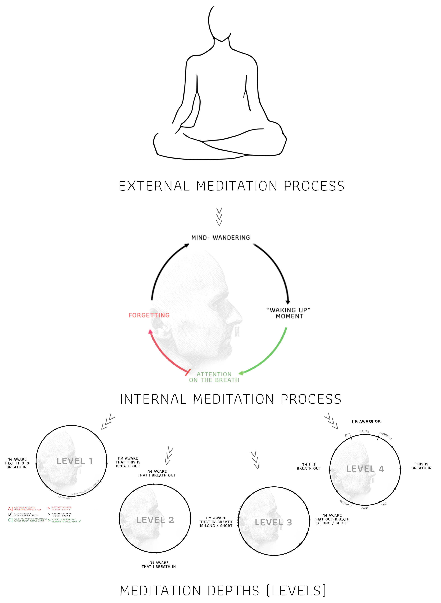

# Meditation - Ānāpānasati

Ānāpānasati \(in Pali language\), meaning "mindfulness of breathing is a form of Buddhist meditation originally taught by Gautama Buddha. Now it is common meditation method in Theravada Buddhism, Tibetan, Zen, Tiantai and as well as Western-based mindfulness programs.

## BENEFITS

* The list of benefits is so huge that there is no point to write it here, basically we can say that it improves all areas of life, health, happiness, spirituality, personal development, business..

## OVERVIEW OF PROCESS

## TUTORIAL


During the mediation session avoid to be disturbed \(find correct time, turn of mobile, etc...\). This should be few minutes of your day dedicated completely to you.


1. Sit down in comfortable posture with back straight
2. Set and countdown of desired time \(you can start with 10 minutes and each week add 1% more time\), for details see the this page:

   

3. Close your eyes and start the timer \(especially if you pass LEVEL 1\) 
4. Relax your body and especially face area and eyes
5. Tell yourself that now you are going to watch your breath, any other activities are not important for you
6. Be aware of the area directly below the nostrils and upper lip


Do not follow the breath going inside or outside. Just be aware of the breath in limited area - around the nostrils and upper lip.


7. Count the number on out breath based on this diagram:

8. If you wander off or forget to count or breath follow this diagram:

9. If you can do 4-6 rounds of uninterrupted counting you pass the LEVEL1 ✓  
10. From here drop the numbers you are telling in your mind and have 30 min. of uninterrupted attention,

11.  If you can keep 30 minutes of uninterrupted attention you have master the LEVEL 2 ✓  
12. From here you __need to observe more subtle characteristic of the breath as the duration of the breaths:

13. After you will find it easy, observe even more details of the breath by this diagram:

14. Increase the time of your sitting up to 3 hours.   
15. Congratulations! Now try to find mediation teacher!

## RESOURCES

[https://www.paaukforestmonastery.org](https://www.paaukforestmonastery.org)  
[https://suttacentral.net/mn118/en/sujato](https://suttacentral.net/mn118/en/sujato)  
[http://www.nspb.net/index.php/nspb/article/viewFile/260/155](http://www.nspb.net/index.php/nspb/article/view/260/155)  
[https://www.ncbi.nlm.nih.gov/pubmed/22685240](https://www.ncbi.nlm.nih.gov/pubmed/22685240)  
[https://www.ncbi.nlm.nih.gov/pmc/articles/PMC3250176/](https://www.ncbi.nlm.nih.gov/pmc/articles/PMC3250176/)  
[https://www.ncbi.nlm.nih.gov/pubmed/24033306](https://www.ncbi.nlm.nih.gov/pubmed/24033306)  
[https://www.ncbi.nlm.nih.gov/pubmed/23643368](https://www.ncbi.nlm.nih.gov/pubmed/23643368)  
[https://www.ncbi.nlm.nih.gov/pubmed/25938614](https://www.ncbi.nlm.nih.gov/pubmed/25938614)  
[https://www.ncbi.nlm.nih.gov/pubmed/26146629](https://www.ncbi.nlm.nih.gov/pubmed/26146629)  
[https://www.ncbi.nlm.nih.gov/pubmed/21035949](https://www.ncbi.nlm.nih.gov/pubmed/21035949)

