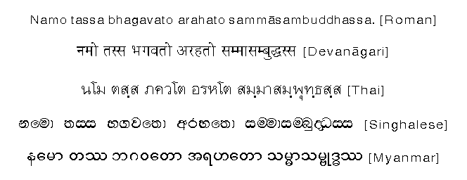

# Pāli language and computers

Pāli is the language of the scriptures of Theravada Buddhism, \(the Pāli Canon or the Tipitaka in Pāli\), which were written in Sri Lanka during the 1st century BC. Pāli has been written in a variety of scripts. In this article I'm focusing only on romanized version of Pāli language.

## EXAMPLE

## Pāli romanized alphabet: 

a ā i ī u ū e o ṃ k kh g gh ṅ c ch j jh ñ ṭ ṭh ḍ ḍh ṇ t th d dh n p ph b bh m y r l ḷ v s h

### 1.1 vowels \(sara\) and consonants \(vyañjana\)

a ā i ī u ū e o aṃ iṃ uṃ  
A Ā I Ī U Ū E O AṂ IṂ UṂ

k kh g gh ṅ  
c ch j jh ñ  
ṭ ṭh ḍ ḍh ṇ  
t th d dh n  
p ph b bh m  
y r l v s  
h ḷ

K KH G GH Ṅ  
C CH J JH Ñ  
Ṭ ṬH Ḍ ḌH Ṇ  
T TH D DH N  
P PH B BH M  
Y R L V S  
H Ḷ

| manner of articulation | guttural | palatal | cerebral | dental | labial |
| :--- | :--- | :--- | :--- | :--- | :--- |
| voiceless unaspirated | k | c | ṭ | t | p |
| voiceless aspirated | kh | ch | ṭh | th | ph |
| voiced unaspirated | g | j | ḍ | d | b |
| voiced aspirated | gh | jh | ḍh | dh | bh |
| nasal | ṅ | ñ | ṇ | n | m |
| semivowel |  | y | r, ḷ | l | v\* |
| spirant / sibilant | h |  |  | s |  |

#### 1.3 Change \(vyaya\), inflection

**subject to inflection:**

* nāma: noun, adjective, pronoun, numeral
* ākhyaāta: verb

**not subject to inflection:**

* upasagga: preposition, verbal prefix
* nipāta: particle, conjunction, adverb

nouns and pronouns have 3 cases

1. subject
2. objects \(direct, indirect, of preposition\)
3. possessive

### 8 cases in Pali

|  Pali case | English case |
| :--- | :--- |
| nominative | subject |
| acusative | direct object |
| instrumental | object of a prep. |
| dative | object of a prep. |
| ablative | object of a prep. |
| genetive | possessive |
| locative | object of a prep. |
| vocative | subject |

### **9 tenses and moods**

1. present
2. perfect
3. periphrastic future
4. future
5. imperative
6. imperfect
7. optative 
8. aorist 
9. conditional

### Characteristics of conjugated verbal forms

| term | translation | Commments |
| :--- | :--- | :--- |
| dhātu | root | can denote an activity or a condition |
| paccaya | ending | used to refer to both verbal and nominal endings |
| vikaraṇa | suffix, infix | can be placed after or in the root before an ending |
| akārāgama | augment | applies to some aorists and the conditional |
| abbhāsa | reduplication | applies to some verbs and some derivative forms |

### They can have...

* 3 times
  1. past
  2. future
  3. present
* time unexpressed \(imperative and optative\)
* 3 persons
  1. first \(he/she/it/they\)
  2. second \(you\)
  3. third \(I/we\)
* 3 factors of action
  1. agent/subject
  2. object
  3. state
* 2 numbers
  1. Singular
  2. Plural
* None of the 3 genders \(participles do have gender, because they have, and decline, as adjectives\)

## RESOURCES

