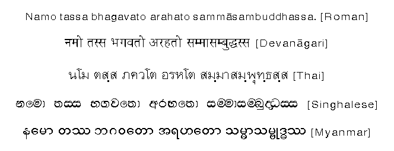

# Pāli language and computers

Pāli is the language of the scriptures of Theravada Buddhism, \(the Pāli Canon or the Tipitaka in Pāli\), which were written in Sri Lanka during the 1st century BC. Pāli has been written in a variety of scripts. In this article I'm focusing only on romanized version of Pāli language.

## EXAMPLE

## Pāli romanized alphabet: {#pāli-alphabet}

a ā i ī u ū e o ṃ k kh g gh ṅ c ch j jh ñ ṭ ṭh ḍ ḍh ṇ t th d dh n p ph b bh m y r l ḷ v s h

