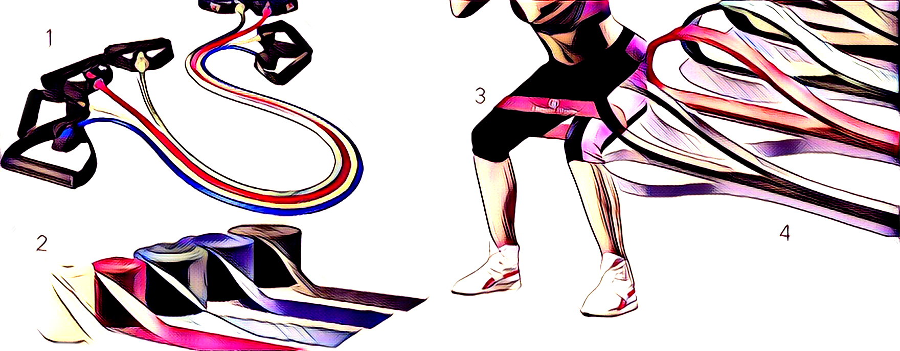

# Resistance bands

A resistance band is a versatile workout tool. It can be used to perform all types of exercises \(upper and lower body\), it’s perfect for strength training and for doing cardio workouts. Bands come in a vast array of sizes and few different types. The materials could differ and so will the resistance that these deliver. 

| _Number on picture_ | _Type_ | _Description_ |
| :--- | :--- | :--- |
| 1 | Resistance tube | rubber tube with fixed handles on each side |
| 2 | Flat band | super flat rubber in rectangle shape |
| 3 | Loop band small | rubber - latex closed loop \(small version\) |
| 4 | Loop band big | rubber - latex closed loop \(big version\) |


Different color represent different resistance of the band. Since there is no unified system, you need to check the resistance brand wise.


## BENEFITS

* Simple, effective, affordable
* compact and lightweight,
* multi functional \(replace the gym\)

## TUTORIAL

1.  Pick up your band
2. Chose exercise and perform it
3. Adjust the resistance if needed

## EXAMPLE

{% embed data="{\"url\":\"https://youtu.be/PSA\_YApzY6I\",\"type\":\"video\",\"title\":\"90 RESISTANCE BAND EXERCISES AND THE MUSCLES THEY TARGET\",\"description\":\"90 RESISTANCE BAND EXERCISES AND WHICH MUSCLES THEY TARGET:\\n\\nCHEST\(0:25\)\\n1\)UPPER CHEST SINGLE ARM PRESS\\n2\)CHEST PRESS\\n3\)UPPER CHEST FLY\\n4\)ALTERNATING PRESS\\n5\)LYING SINGLE ARM FLY\\n6\)LOWER CHEST SINGLE ARM PRESS\\n7\)BAND RESISTED PUSH UP\\n8\)UPPER CHEST ALTERNATING FLY\\n9\)SINGLE ARM PRESS\\n10\)LOWER CHEST ALTERNATING PRESS\\n11\)CHEST FLY\\n12\)CROSS BODY CHEST PRESS\\n13\)NEUTRAL GRIP PRESS\\n14\)LOWER CHEST PRESS\\n15\)LOWER CHEST FLY\\n16\)ALTERNATING FLY\\n17\)LOWER CHEST ALTERNATING FLY\\n18\)UPPER CHEST PRESS\\n19\)UPPER CHEST ALTERNATING PRESS\\n\\nABS\(5:48\)\\n1\)TWIST\\n2\)SIDE BEND \(STANDING ON BAND\)\\n3\)SIDE BEND \(ATTACHED\)\\n4\)HEEL TAP\\n5\)OVERHEAD SIDE BEND\\n6\)BICYCLE CRUNCH\\n7\)CRUNCH\\n8\)REVERSE CRUNCH\\n9\)LIFTING\\n10\)CHOPPING\\n11\)SCISSORS\\n12\)KNEELING CRUNCH\\n\\nTRICEPS\(9:42\)\\n1\)PRESSDOWN\\n2\)SINGLE ARM OVERHEAD EXTENSION \(ATTACHED\)\\n3\)SINGLE ARM OVERHEAD EXTENSION \(STANDING ON BAND\)\\n4\)KICKBACK \(ATTACHED\)\\n5\)KICKBACK \(STANDING ON BAND\)\\n6\)LYING EXTENSION\\n7\)OVERHEAD EXTENSION \(STANDING ON BAND\)\\n8\)REVERSE GRIP PRESSDOWN\\n9\)OVERHEAD EXTENSION \(ATTACHED\)\\n10\)FRONT PLANK PRESSDOWN\\n11\)SIDE PLANK PRESSDOWN\\n\\nBICEPS\(12:38\)\\n1\)45 DEGREE CURL \(ATTACHED\)\\n2\)DRAG CURL\\n3\)CLOSE GRIP CURL\\n4\)HORIZONTAL BICEP CURL\\n5\)STANDARD CURL \(STANDING ON BAND\)\\n6\)SINGLE ARM HERCULES CURL\\n7\)HAMMER CURL\\n8\)CHEST TAP CURL\\n9\)CROSS CHEST CURL \\n10\)CROSS BODY CURL\\n11\)WIDE GRIP CURL\\n12\)REVERSE GRIP CURL\\n13\)BICEP 21\'S\\n14\)KNEELING PREACHER CURL\\n15\)STANDARD CURL \(ATTACHED\)\\n16\)FRONT PLANK CURL\\n17\)SIDE PLANK CURL\\n\\nLOWER BODY\(18:08\)\\n1\)GLUTE BRIDGE\\n2\)DEADLIFT \\n3\)SQUAT\\n4\)SINGLE LEG GLUTE BRIDGE\\n5\)SINGLE LEG DEADLIFT\\n6\)DROP LUNGE \\n7\)LUNGE \\n8\)ABDUCTION \\n9\)CALF PRESS\\n10\)SQUAT TO PRESS\\n11\)SQUAT TWIST \\n\\nSHOULDERS\(21:57\)\\n1\)SHOULDER PRESS\\n2\)CROSS BODY SHOULDER RAISE\\n3\)FRONT AND LATERAL RAISE \(STANDING ON BAND\)\\n4\)UPRIGHT ROW\\n5\)REAR DELT LIFT\\n6\)SHOULDER SHRUG\\n7\)REAR DELT FLY \(ATTACHED\)\\n8\)BENT OVER FLY\\n9\)FRONT RAISE\(ATTACHED\)\\n10\)LATERAL RAISE\\n11\)EXTERNAL ROTATION\\n12\)FRONT RAISE \(STANDING ON BAND\)\\n13\)SIDE PLANK LATERAL RAISE\\n\\nBACK\(26:40\)\\n1\)NARROW GRIP HIGH ROW\\n2\)BENT OVER LAT PULL\\n3\)CLOSE GRIP ROW\\n4\)CRANK THE MOWER\\n5\)WIDE GRIP HIGH ROW\\n6\)ALTERNATING BENT OVER LAT PULL\\n7\)HAND PLANK LAT PULL\",\"icon\":{\"type\":\"icon\",\"url\":\"https://www.youtube.com/yts/img/favicon\_144-vfliLAfaB.png\",\"width\":144,\"height\":144,\"aspectRatio\":1},\"thumbnail\":{\"type\":\"thumbnail\",\"url\":\"https://i.ytimg.com/vi/PSA\_YApzY6I/maxresdefault.jpg\",\"width\":1280,\"height\":720,\"aspectRatio\":0.5625},\"embed\":{\"type\":\"player\",\"url\":\"https://www.youtube.com/embed/PSA\_YApzY6I?rel=0&showinfo=0\",\"html\":\"
<iframe src=\\\"https://www.youtube.com/embed/PSA\_YApzY6I?rel=0&amp;showinfo=0\\\" style=\\\"border: 0; top: 0; left: 0; width: 100%; height: 100%; position: absolute;\\\" allowfullscreen scrolling=\\\"no\\\"></iframe>
\",\"aspectRatio\":1.7778}}" %}

## SOURCES

[https://www.ncbi.nlm.nih.gov/pmc/articles/PMC5140827](https://www.ncbi.nlm.nih.gov/pmc/articles/PMC5140827/)  
[https://www.ncbi.nlm.nih.gov/pmc/articles/PMC3588619/](https://www.ncbi.nlm.nih.gov/pmc/articles/PMC3588619/)  
[https://www.hometraininghero.com/what-is-resistance-band-training-the-science/](https://www.hometraininghero.com/what-is-resistance-band-training-the-science/)  

